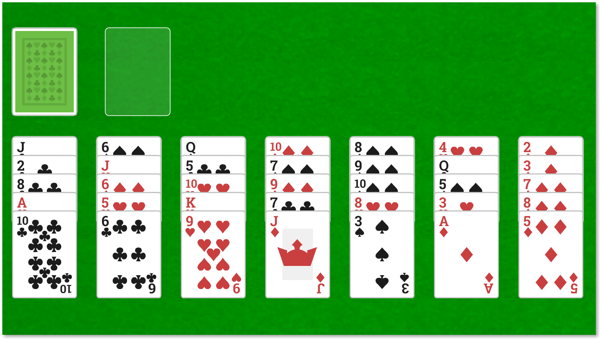

# Golf Solitaire

Golf Solitaire game with AI (plus other features like hints, undo/redo,etc)

 
  A look of the game (<i>For more see "screenshots"</i>)

## About Golf

Golf Solitaire is one of the most popular as well as one of the most difficult form of solitaire! Unlike other solitaire it depends more intellect than luck - which makes it a good research field for Artificial Intelligence! One has to be really careful with his algorithm since the permutations and combinations are super-huge! My algorithm is very simple but it's still pretty good I'd say! It cannot score 35 out of 35 but still around 30 - so it's not all bad I think (considering how simple the algorithm is)

## Controls

- Press <kbd>H</kbd> for some hints
- Press <kbd>A</kbd> for the AI to help you
- Press <kbd>Ctrl-Z</kbd> to undo
- Press <kbd>Ctrl-Y</kbd> to redo

## Rules for Golf

The main goal of the game is to move all the cards to the waste which can be build up from the available cards on the Tableau. Only Deuces can be placed on Aces and nothing can be played on to a King. Cards are dealt singly from Stock to Waste. There are no redeals. Every card moved from Tableau to Waste scores one point. The maximum possible score is 35!
